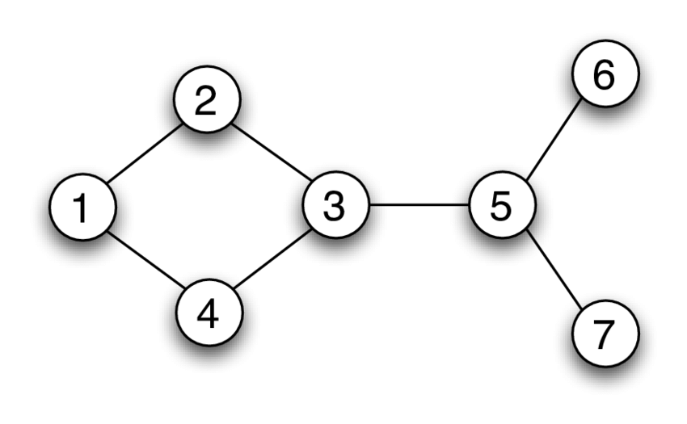

# Graphs

What if you want to find the shortest path between two places (e.g. two cities)?
This is when you would use a graph. Each city could be a node, and every path
between cities would be edge.

### Definition

A graph is an abstract data structure that can be used to represent complex, non-linear relationship between objects. Unlike a tree, a graph set at least as many edges as nodes.

### Node

Represents elements.

### Edges

Represents a connection between elements.

### Representing a graph

Graphs are usually represented using an adjacency matrix. If the table has a 0 it means that the two numbers are not connected.

### Directed Graph

All edges of a directed graph have a direction indicating what is the start vertex and what is the end vertx.

### Undirected Graph

All edges of an undirected graph have no direction. It can go in both ways between the two vertices.

