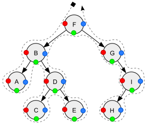

# Traverse a Tree

What if you wanted to visit every element ina tree, and you did that, so you could find an element, or operate on all the elements. This is where tree traversal comes into play.

### Depth First Search

Depth first search visits the nodes until it reaches a leaf node, then it `backtracks` and visits the other node of the parent.

Here is an example of Depth First Search

```java
public class Main{
    public voolean doesElementExist(MyTreeNode root, int element){
        if(root == null){
            // We reached the end
            return false;
        }
        if(root.data == element){
            // The element exists
            return true;
        }
        // Visit subtrees
        return doesElementExist(root.left,element)
                || doesElementExsist(root.right, element);
    }
}
```

### Tree Traversals



In the image above, red is pre-order, green is in-order, and blue is post-order traversal.

#### Pre-Order Traversal

Visit the current node, then the left subtree, the right subtree.

```java
public class Main{
    public static void preOrder(Node node){
        if(node == null){
            return;
        }
        System.out.println(node.data);
        preOrder(node.left);
        preOrder(node.right);
    }
}
```

#### In-Order Traversal

In order traversal visits the left subtree, then the current node,
the right subtree

```java
public class Main{
    public static void preOrder(Node node){
        if(node == null){
            return;
        }
        preOrder(node.left);
        System.out.println(node.data);
        preOrder(node.right);
    }
}
```

#### Post-Order Traversal

Visit the left subtree, then the right subtree, then the current node.

```java
public class Main{
    public static void preOrder(Node node){
        if(node == null){
            return;
        }
        preOrder(node.left);
        preOrder(node.right);
        System.out.println(node.data);
    }
}
```