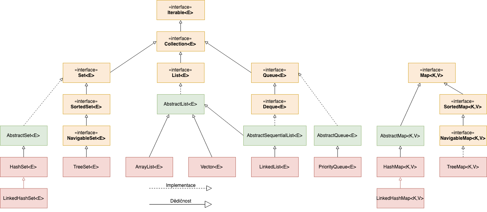

# Collection Interface

ArrayLists is part of the Collections framework. We also have data structures such as sets, queues, stacks, and more. We will get to all of these.

### Collection

A collection is any group of individual objects which are represented as a single unit.

In Java, there is a Collection framework that holds all the different collection classes and interfaces, such as sets queses, stacks, etc.

There are two main root interfaces: Collection and Maps.

### Collection Interface Useful Methods

All Collections have these methods.

`add(element)` adds an element to the collection
`addAll(collection)` adds all elements from a collection to this collection 
`clear()` clears collection
`contains(element)` returns true if collection contains the element.
`remove(element)` remove the element
`size()` returns the size of the collection
`toArray()` returns an array with all collection elements