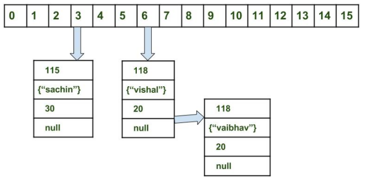
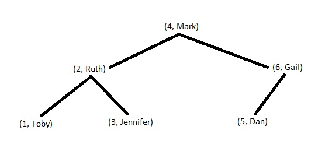

# Maps

You want to know the phone number of a bunch of people. However, you hate flipping through every page to find the number matching a specific name. You can use Maps to solve this problem!

### Definition

A collection that associates objects called keys with objects called values.

### Key and Value

The key is a used to lookup a value, and keys must be unique

The value is the result of a lookup

In a dictionary, the key is the word, white the value is the definition.

### Maps in Java

In the java collections framework, there are two primary classes that implement the `Map` interface: `HashMap`'s abd `TreeMap`s.

### HashMaps

Like `HasSet`, `HashMap` uses a *Hash Table8 to store key value pairs.
This allows pretty much constant lookup and insertion.



#### Example of `HashMap`

```java
public class Main{
    public static void main(String[] args) {
        Map<String, Integer> phoneBook = new HashMap<>();
        //Insertion
        phoneBook.put("Bob", 1234567890);
        phoneBook.put("Joe", 0987654321);
        //Lookup
        int bobsNumber = phoneBook.get("Bob");
        //Remove Bob
        phoneBook.remove("Bob"); //Bob is no longer in the phonebook
        for(Map.Entry<String, Integer> entry : phoneBook.entrySet()){
            System.out.println(entry.getKey());
            //Printing out the value
            System.out.println(entry.getValue());
        }
        //The shorter way
        phoneBook.forEach((k, v) -> {
            //Printing out the key
            System.out.println(k);
            //Printing out hte value
            System.out.println(v);
        });
    }
}
```

#### Benifits

- Constant time insertion
- Constant time lookup
- Constant time removal

#### Drawbacks

- If you have bad hash, it is slow
- You need to think of a good hash function for your object
- Unordered

### `TreeMaps`

ThreeMaps use a binary search tree to implement the Map interfac. It has logarithmic complexity for most operations

#### Example

```java
public class Main{
    public static void main(String[] args) {
        Map<String, Integer> phoneBook = new TreeMap<>();
        //Insertion
        phoneBook.put("Bob", 1234567890);
        phoneBook.put("Joe", 0987654321);
        //Lookup
        int bobsNumber = phoneBook.get("Bob");
        //Remove Bob
        phoneBook.remove("Bob"); //Bob is no longer in the phonebook
        
        //looping through them map in sorted key order.
        for(Map.Entry<String, Integer> entry : phoneBook.entrySet()){
            System.out.println(entry.getKey());
            //Printing out the value
            System.out.println(entry.getValue());
        }
        //The shorter way
        phoneBook.forEach((k, v) -> {
            //Printing out the key
            System.out.println(k);
            //Printing out hte value
            System.out.println(v);
        });
    }
}
    }
}
```

#### Image



#### Benefits

- Logarithmic time insertion, deletion, lookup
- Ordered from least to greatest by key
- Guaranteed time complexity

### Drawbakcs

- Slower than`HashMap`

