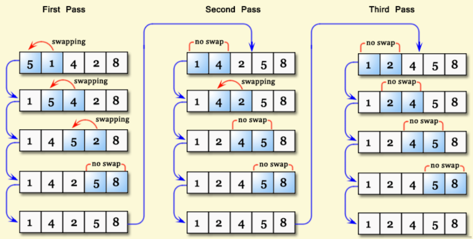
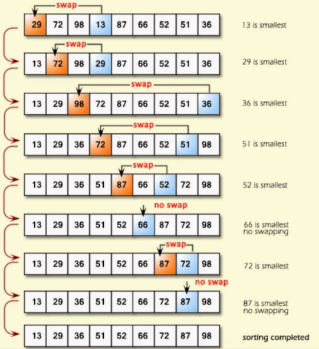
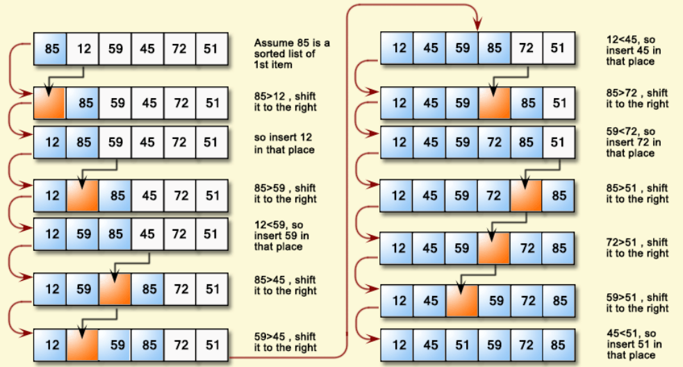

# Sorting

Sorting algorithms are used to transform and unsorted array into a sorted one

## Bubble Sort

Bubble sot is an OO(n^2) sorting algorithm that works by repeatedly comparing indices within an array and swapping them if they are not in sorted order.

### Steps

- Compare the first and second indices within the array. If they are not in sorted order, swap their contents.
- Repeat this set, but instead of the first and second indices, we use the second and third indices.
- Keep on repeating this process until you reach the end of the array.
- Keep on repeating the tree above until the entire array is sorted. You can use this with a counter.



### Code

```java
public class Main {
    public static void bubbleSort(int[] arr) {
        while (true) {
            // Count is used to keep track of how many swaps we did
            int count = 0;
            // Loop through the entire array
            for (int i = 1; i < arr.length; i++) {
                // Check if the elements at indices i and i - 1 are not sorted
                if (arr[i] < arr[i - 1]) {
                    // If they are not sorted, swap then
                    int temp = arr[i - 1];
                    arr[i - 1] = arr[i];
                    arr[i] = temp;
                    // Increment count by 1 because we did swap
                    count += 1;
                }
            }
            // If count equals zero, meaning we did no swaps, the array is
            // already sorted, so we break out of the while loop
            if (count == 0) {
                break;
            }
        }
    }
}
```

## Selection Sort

Selection sort works by repeatedly finding the minimum element in an array adn then placing that element near the front of the array, in sorted order.

### Steps

- Loop through the array and find the minimum element
- Move this element the front of the array
- Repeat the above steps, but instead of the searching entire array for the minimum element, we do not search the first element since we already know it is in the correct position
- Keep on repeating the above three steps, each time searching a smaller and smaller portion of the array, until the entire array is sorted



```java
public class Main{
    public static void selectionSort(int[] arr) {
        // This loops through every index of the array
        for (int i = 0; i < arr.length; i++) {
            // Min is used to keep track of the index of the smallest element
            int min = i;
            // Loops through the array starting from the index i, because
            // everything before "i" has already been sorted
            for (int j = i; j < arr.length; j++) {
                // If the element at index j is smaller than our current minimum,
                // set min to j to update the index of the minimum value
                if (arr[j] < arr[min]) min = j;
            }
            // Swaps the  values of the array at indices i and min to move the
            // minimum we found to a position near the front of the array
            int temp = arr[i];
            arr[i] = arr[min];
            arr[min] = temp;
        }
    }
}
```

## Insertion Sort

Insertion sort works by maintaining a sorted portion on the left and an unsorted
portion on the right, and repeatedly moving elements from the beginning of the
unsorted portion into the correct position within hte sorted portion.

### Steps

- Select a key from the beginning of the unsorted portion of the array
- Check if the key is less than the number to its left
- If the key is less, then move the number one index to the right and decrement
the index you are looking at
- Repeat the above two steps until hte key is no longer less than the number to 
its left
- Set the value of your current index to the key
- Repeat all previous steps until the array is sorted



### Code

```java
public class Main{
    public static void insertionSort(int[] arr) {
        for(int i = 1; i < arr.length; i++){
            // Key is the value at the beginning of the unsorted section
            int key = arr[i];
            // Index keep track of
            int index = i - 1;
            while(index >= 0 && key < arr[index] ){
                arr[index + 1] = arr[index];
                index--;
            }
            arr[index + 1] = key;
        }
    }
}
```