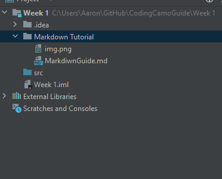

# Markdown Tutorial!

# This is a heading

## This smaller heading

### This is an even smaller heading

This is normal text!
This is on the same line as above

**This is bolded text** this is unbolded 
*This is italicized* this is not

>This is blockquote text
>
>it can continue

1. Ordered Lost
2. For Lists

- Unordered Lost
- For bullet points

`// for small amounts of code`

The `while()` loop is cool!

```java
public class Main{
    public static void main(String[]args){
        System.out.println("This is how you write jave!");
    }
}
```

| Tables           | More tables | 
|------------------|-------------|
| This is a table  | Tables!     |

- [ ] This is a task list!
- [ ] Remeber the space!
- [ ] To mark a task complete, use x

For a horizantal line

---

For links:

[The Guide](https://docs.google.com/document/d/1jfRVDoKkYBZfesIIArBsWKQV04Zbh0z39QwY93OWi4Q/edit?usp=sharing)

Images you can paste directly


